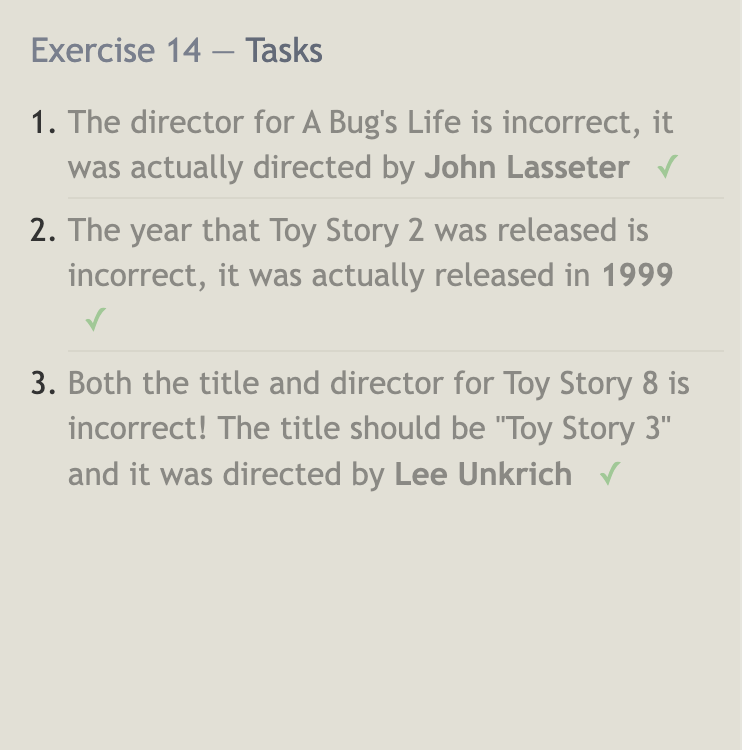

# SQL Database

> SQL --> Structured Query Language; industry standard query language used to access database from a language like C/C++, Java or a web app

- access a database to perform queries and get data out of the database; **Oracle, SQL server, MySQL, Sybase, and PostgreSQL**

- *create a database* - CREATE DATABASE sql_name(name you want to give your database);

- *create table for database* - CREATE TABLE table_name( column_name1 data_type, column_name 2 data_type, etc...); --> example: CREATE TABLE users ( id INTEGER PRIMARY KEY, username VARCHAR(255), password VARCHAR(255) );

- *insert data into table* - INSERT INTO users (username, password) VALUES('username', 'password'); *this will insert a new row into the 'users' table with the username and password

- *to query data from a table* - SELECT * FROM users; --> retrives all rows from the 'users' table

- *update data in a table* - UPDATE users SET password = 'new_password' WHERE username = 'username';

- *delete data from a table* - DELETE FROM users WHERE usernmae = 'username';

-**VARCHAR** - stores character strings (like usernames, passwords)

-**INTEGER** - stores numerical data

-**DATE** - stores date values

- JOINING TABLES -

- *INNER JOIN* - combines rows from 2+ tables based on common column

- *LEFT JOIN* - returns all rows from left table and any rows from right table that match

